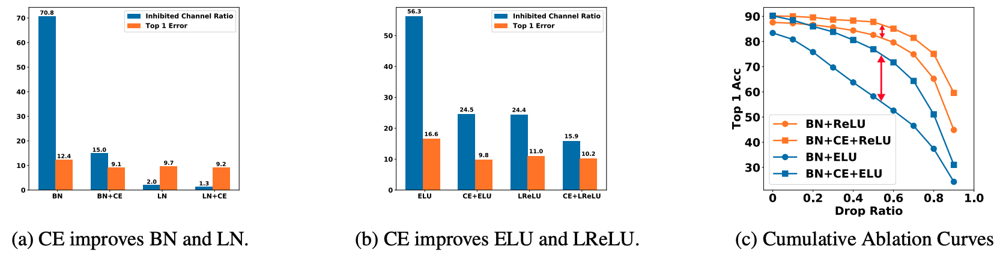

# Channel Equilibrium Networks for Learning Deep Representation

This is the PyTorch implementation of the paper **Channel Equilibrium Networks for Learning Deep Representation**, ICML2020.

By Wenqi Shao, Shitao Tang, Xingang Pan, Ping Tan, Xiaogang Wang, Ping Luo.

[https://arxiv.org/pdf/2003.00214.pdf)

## Channel Equilibrium Networks
We design a novel neural building block, termed Channel Equilibrium (CE) block, which enables channels at the same layer to contribute equally to the learned representation.
<div align=center></div>

**Comparisons of top-1 accuracies** on the validation set of ImageNet, by using ResNet50 trained with BN and CE.

|Model|Top-1|Top-5|
| :----:  | :--: |:--: |
| ResNet50-BN | 76.6|93.0|
| ResNet50-CE | 78.2|94.1

## Getting Started
* Install [PyTorch](http://pytorch.org/)
* Clone the repo:
  ```
  git clone https://github.com/Tangshitao/CENet.git
  ```

### Requirements
- python packages
  - pytorch>=0.4.0
  - torchvision>=0.2.1
  - tensorboardX
  - pyyaml

### Data Preparation
- Download the ImageNet dataset and put them into the `{repo_root}/data/imagenet`.

### Training a model from scratch
```
./train.sh
```
Number of GPUs and configuration file to use can be modified in train.sh

### Evaluating performance of a model
Download the pretrained models from Model Zoo and put them into the `{repo_root}/model_zoo`
```
./test.sh
```

Or you can specify the checkpoint path by modifying test.sh
```
--checkpoint_path model_zoo/ssn_8x2_75.848.pth \
```

## Model Zoo

We provide models pretrained with CE block on ImageNet. 

| Model | Top-1<sup>*</sup> | Top-5<sup>*</sup> | Download |
| :----:  | :--: | :--:  | :--:  |
|ResNet50v1+CE | 78.2% | 94.1% |[[Google Drive]](https://drive.google.com/file/d/1s4dBFqj8TjSsHo36t0UrG_q5Dab_YmiJ/view?usp=sharing)


*single-crop validation accuracy on ImageNet (a 224x224 center crop from resized image with shorter side=256)

In evaluation, download the above models and put them into the `{repo_root}/model_zoo`.


## Citation
If you find this work helpful in your project or use our model zoo, please consider citing:
```
@article{shao2020channel,
  title={Channel equilibrium networks for learning deep representation},
  author={Shao, Wenqi and Tang, Shitao and Pan, Xingang and Tan, Ping and Wang, Xiaogang and Luo, Ping},
  journal={arXiv preprint arXiv:2003.00214},
  year={2020}
}

```
